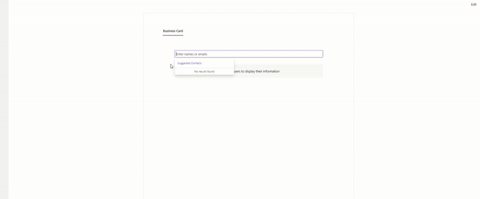

# Business Card Generator - SharePoint Framework Web Part

### Demo



The demo GIF above showcases:
- Searching for users
- Displaying business cards with contact information
- QR code generation for easy contact sharing

## YoutubeDemo Link
[Video Demo](https://youtu.be/hW6oC_29tHI)

## Overview

The Business Card Generator is a SharePoint Framework (SPFx) web part that allows users to search for colleagues and display their profile information in a business card format. The card includes contact details, organizational information, presence status, and a QR code that can be scanned to instantly add the contact to a mobile device.

## Features

- **User Search**: Search for users across the organization using a Fluent UI People Picker
- **Presence Status**: Display real-time user presence status (Available, Busy, Away, etc.)
- **Account Status**: Quickly identify if a user account is enabled or disabled
- **Grid Layout Contact Details**: Organized contact information with intuitive icons
- **QR Code Generation**: Each card includes a QR code with vCard data for easy contact sharing
- **Multiple User Selection**: Search and display multiple business cards simultaneously

## Technical Details

### Components

- **UserCard**: The main component that displays user information in a business card format
- **GraphService**: Service class that handles Microsoft Graph API calls to fetch user data

### Technologies Used

- React 17.x
- SharePoint Framework (SPFx)
- Microsoft Graph API
- PnPjs Graph library
- Fluent UI React components
- QRCode.react for QR code generation

## Setup Instructions

### Prerequisites

- Node.js v18
- Microsoft Graph API permissions

### Installation

1. Clone the repository
   ```
   git clone https://github.com/Karthik-P99/SPFxBusinessVCard
   ```

2. Navigate to the project folder
   ```
   cd SPFxBusinessVCard
   ```

3. Install dependencies
   ```
   npm install
   ```

4. Build the solution
   ```
   gulp build
   ```

5. Bundle and package the solution
   ```
   gulp bundle --ship
   gulp package-solution --ship
   ```

6. Upload the `.sppkg` file from the `sharepoint/solution` folder to your SharePoint App Catalog

7. Approve the requested API permissions in the SharePoint Admin Center

### Required API Permissions

The following Microsoft Graph API permissions are required:
- User.Read.All
- Presence.Read.All

## Usage

1. Add the web part to a SharePoint page
2. Use the people picker to search for colleagues by name or email
3. View their business card with detailed information
4. Scan the QR code with a mobile device to add the contact to your address book

## Development

### Available Commands

- `gulp serve`: Runs the web part in development mode
- `gulp build`: Builds the web part
- `gulp bundle --ship`: Bundles the web part for production
- `gulp package-solution --ship`: Creates the deployment package

### Extending the Solution

To add more user information or customize the card layout:

1. Update the `IUserProfile` interface in the models folder
2. Modify the `GraphService.getUserProfile` method to fetch additional data
3. Update the UserCard component JSX to display the new information

## License

MIT

## Contributors
1.  Akash
2.  Anita
3.  Karthikeyan
4.  [Karthik Panyaram](https://www.linkedin.com/in/karthik-panyaram/)


## Acknowledgements

- Microsoft SharePoint PnP Community
- Fluent UI Team
- QRCode.React (ISC License) - Used for QR code generation
  - https://github.com/zpao/qrcode.react
  - ISC License allows free use, modification, and distribution with appropriate attribution
